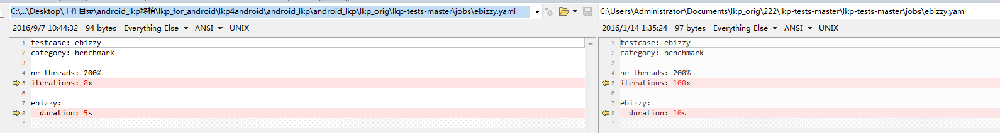
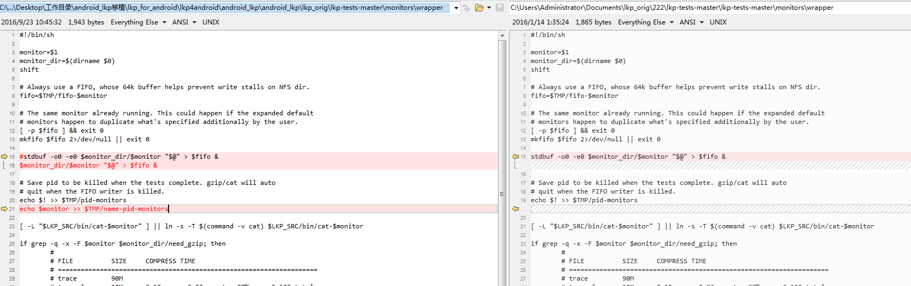
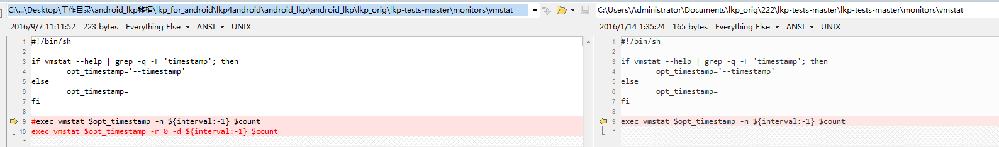
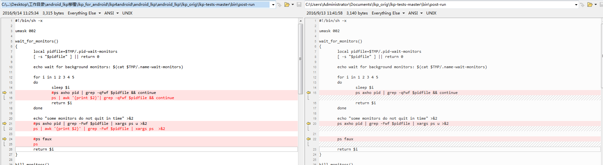
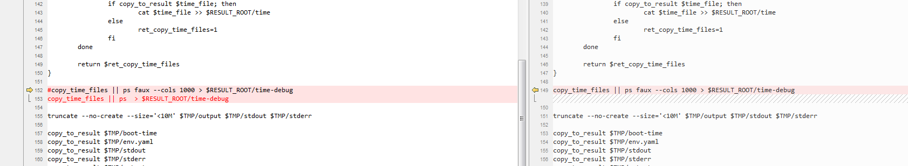

使用方法
--------

cd lkp\_for\_android

修改run\_lkp4android.sh中

ip\_of\_android="192.168.2.8" 为android机器IP

执行

./run\_lkp4android.sh

需要的文件：
------------

### $LKP\_SRC目录

/root/lkp\_orig/lkp-tests-master

/monitors/ 各种monitor的可执行文件

/lib/job.sh

/bin/cat-{monitor}

/tests/

### /result目录

/result

测试结果的保存，job.sh

### /lkp目录

/lkp/benchmarks 包含了bentchmark对应的可执行文件。

/lkp/paths 包含了测试结果的列表。

### $TMP目录

/tmp/lkp-root/xxxx

存放benchmark源码编译中间结果。

result的monitor中间结果。

各种pidfile

文件来历
--------

### 静态编译

#### $LKP\_SRC/monitor/event/ wakeup.c

#### ebizzy.c 

#### coreutils

cat nproc tee truncat（静态编译coreutils）

#### gzip

gzip(静态编译gzip)

### 下载运行lkp

#### 下载lkp

mkdir -p /root/lkp\_orig/

cd /root/lkp\_orig/

git clone [*https://github.com/fengguang/lkp-tests.git*](https://github.com/fengguang/lkp-tests.git)

mv lkp-test lkp-test-master

cd lkp-test-master

#### ./jobs/ebizzy.yaml

修改

运行8次每次运行5秒

#### 运行lkp生成ebizzy测试用例相关信息

export LKP\_SRC=$PWD

export PATH=$PATH:$LKP\_SRC/bin

lkp install $LKP\_SRC/jobs/ebizzy.yaml

lkp split-job $LKP\_SRC/jobs/ebizzy.yaml

lkp run ./ebizzy-200%-8x-5s.yaml

lkp result ebizzy

输出结果的最后一行即为此次的$result\_root

/result/ebizzy/200%-8x-5s/elwin-virtual-machine/ubuntu/defconfig/gcc-5/4.4.0-22-generic/1

### 修改LKP代码适用于android

mkdir -p /root/ lkp4android/android\_lkp

cd /root/lkp4android

cp -a /root/lkp\_orig/ . /android\_lkp

cp -a /lkp . /android\_lkp

cp -a /result . /android\_lkp

cd android\_lkp

#### ./lkp\_orig/lkp-tests-master/monitors/wrapper

去掉了stdbuf

加上了一些monitor的名字便于对照其pid

#### ./lkp\_orig/lkp-tests-master/monitors/vmstat

修改了不兼容的命令行参数

#### ./lkp\_orig/lkp-tests-master/bin/post-run 

都是ps命令不兼容。

cd /root/lkp4android/

tar zcf android\_lkp.tar.gz android\_lkp

rm -rf android\_lkp

### 建立超链接和export环境变量

【在这里继续】

调试方法：
----------

如果是shell脚本则在shabang后面加上-x则会输出调试信息。很容易排错。

如果是ruby脚本，则需要在关键部位插入puts 输出语句，知道代码执行路径，和中间变量的值。

边运行边改错，改错从最前面的错误一个一个改起。

每修该一次错误，都运行一次，查看结果。

需要对代码的执行流程有一个整体的了解。

增加新的测试用：
----------------

新增nbench可执行程序；

lkp split job 生成xxx.yaml

lkp run 生成 /result目录

新增/result目录 包括里面的 job.sh

### run-ebizzy.sh

run\_the\_bench()

{

cp ebizzy /lkp/benchmarks/ebizzy/ebizzy

chmod +x /lkp/benchmarks/ebizzy/ebizzy

export RESULT\_ROOT=/result/ebizzy/200%-8x-5s/elwin-virtual-machine/ubuntu/defconfig/gcc-5/4.4.0-22-generic/1/

}
